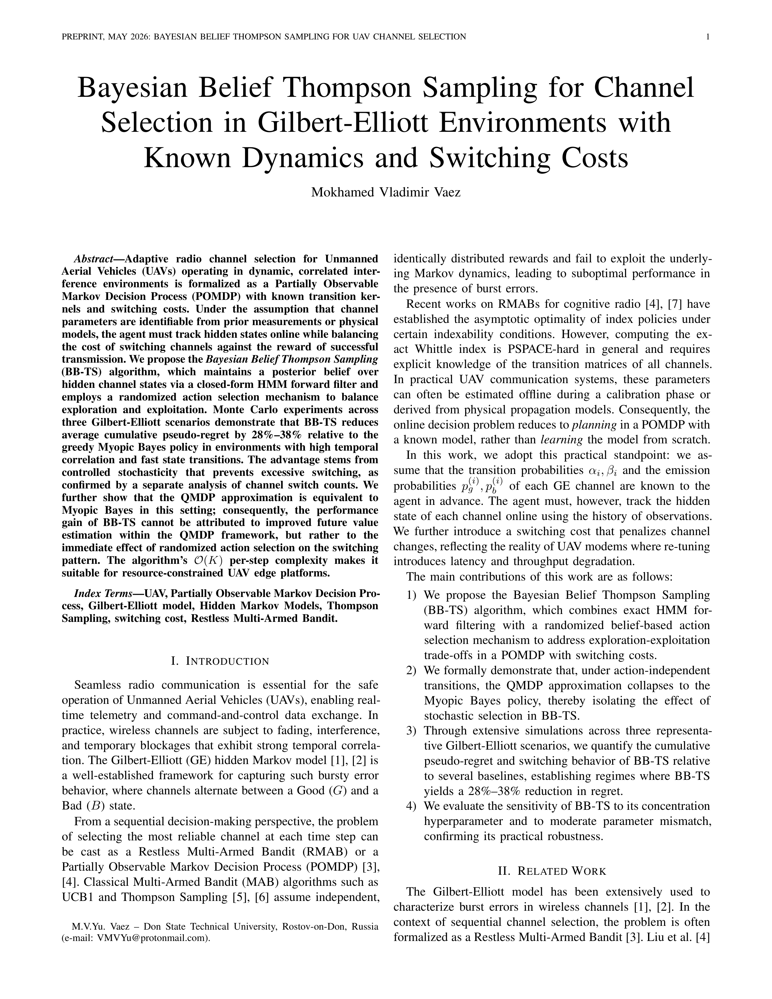
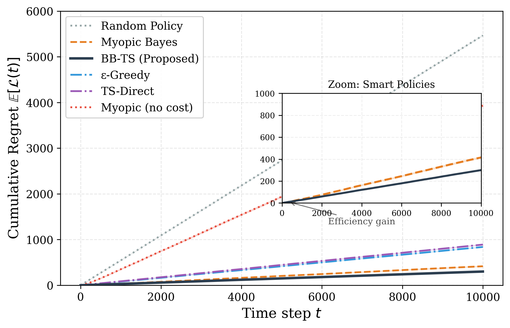

# UAV Radio Channel Selection via Bayesian Belief Thompson Sampling (BB-TS)

[](https://www.python.org/downloads/)
[](https://opensource.org/licenses/MIT)

This repository contains the implementation of the **Bayesian Belief Thompson Sampling (BB-TS)** algorithm for adaptive radio channel selection in Unmanned Aerial Vehicles (UAVs). The project addresses the challenge of non-stationary, temporally correlated interference described by the **Gilbert-Elliott Hidden Markov Model (HMM)**.



## 🚀 Key Features

- **BB-TS Algorithm**: Integrates an HMM forward filter with Thompson Sampling to track hidden channel states and optimize decision-making.
- **Gilbert-Elliott Environment**: A high-fidelity simulation of radio channels with burst errors and temporal correlation.
- **Comparative Analysis**: Includes benchmarks against UCB1, Standard Thompson Sampling, Discounted variants, and Myopic Bayes strategies.
- **Ablation Study**: Includes sensitivity analysis for the $\kappa$ parameter, demonstrating the robustness of the Bayesian belief scaling.
- **Scientific Validation**: Demonstrates up to **6x reduction in cumulative regret** in highly correlated environments.

## 📊 Results

The proposed BB-TS algorithm significantly outperforms classical methods by rapidly recognizing channel degradation from just a few lost packets. The evaluation covers base, high-correlation, and fast-switching scenarios.



*Comparison of cumulative regret across different strategies in a high-correlation scenario (Publication-quality plot).*

## 🛠 Installation

This project uses [uv](https://github.com/astral-sh/uv) for fast dependency management.

```bash
# Clone the repository
git clone https://github.com/your-username/uav-radio-bandits-hmm.git
cd uav-radio-bandits-hmm

# Install dependencies and create a virtual environment
uv sync
```

## 📖 Usage

This project uses [uv](https://github.com/astral-sh/uv) for easy execution. All entry points are located in the `scripts/` directory.

### Run Experiments
To run the full simulation and collect data:
```bash
uv run scripts/experiment.py
```

### Statistical Analysis
To perform statistical significance tests (Mann-Whitney U test):
```bash
uv run scripts/stat_test.py
```

### Plotting
To generate basic regret plots:
```bash
uv run scripts/plotting.py
```

### Publication Figures
To generate high-quality plots for the article:
```bash
uv run scripts/make_article_plots.py
```

### Ablation Study
To run the sensitivity analysis for the $\kappa$ parameter:
```bash
uv run scripts/ablation_study.py
```

## 📄 Publication

The theoretical background, mathematical proofs, and detailed experimental setup are described in the research paper **"Bayesian Approach to Adaptive UAV Radio Channel Selection in Gilbert-Elliott Hidden Markov Environments"**.

## 🤝 Citation

If you use this work in your research, please cite:

```bibtex
@article{Vaez2026,
  title={Bayesian Approach to Adaptive UAV Radio Channel Selection in Gilbert-Elliott Hidden Markov Environments},
  author={Vaez Mokhamed Vladimir Yussefovich},
  journal={Preprint},
  year={2026}
}
```
